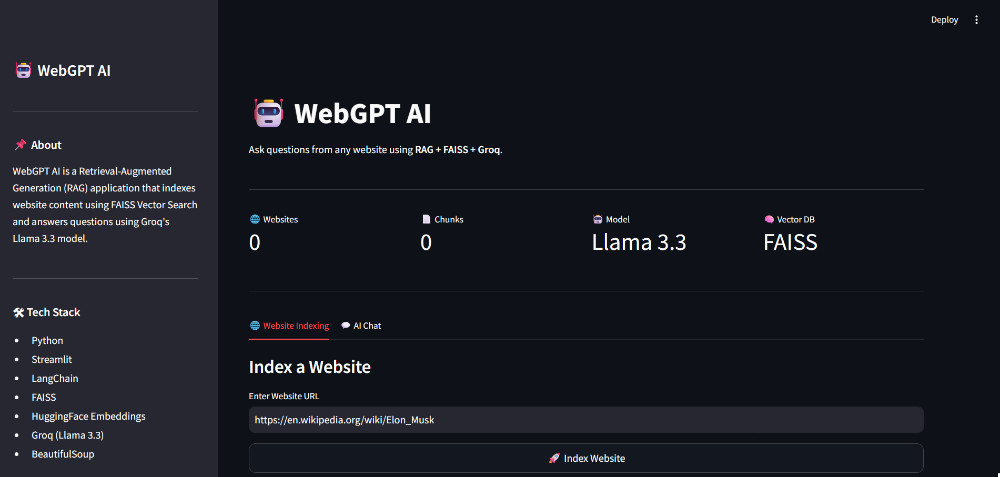
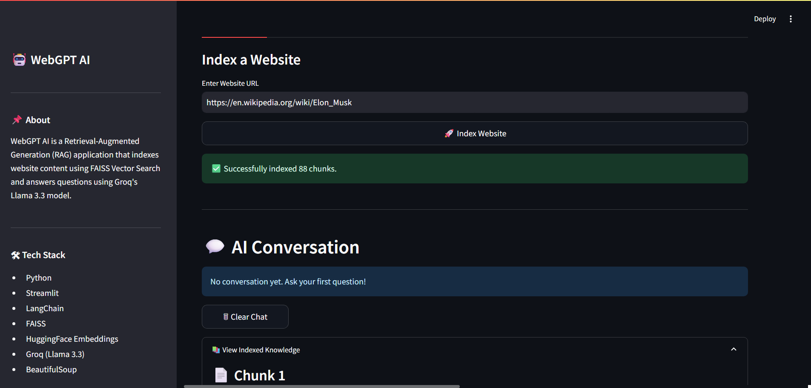
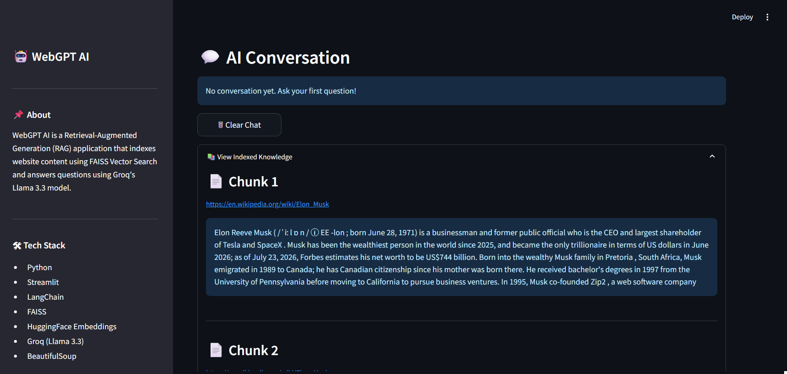
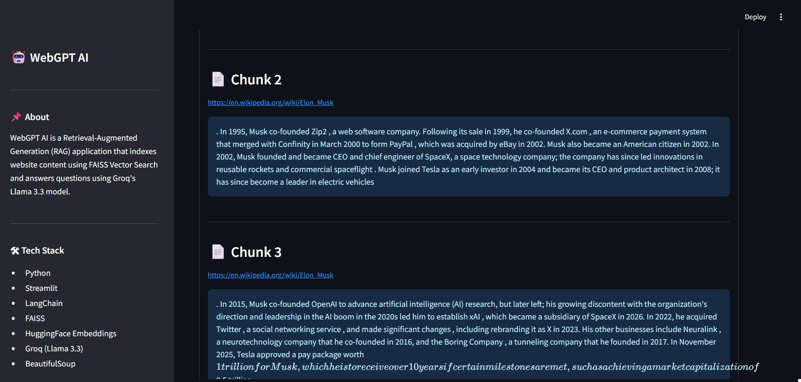
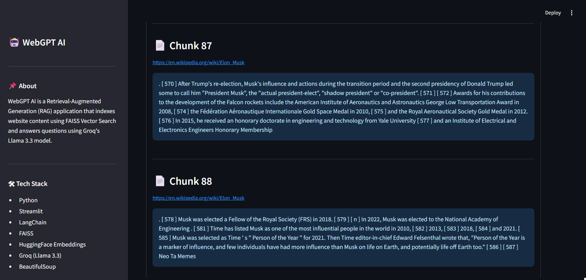
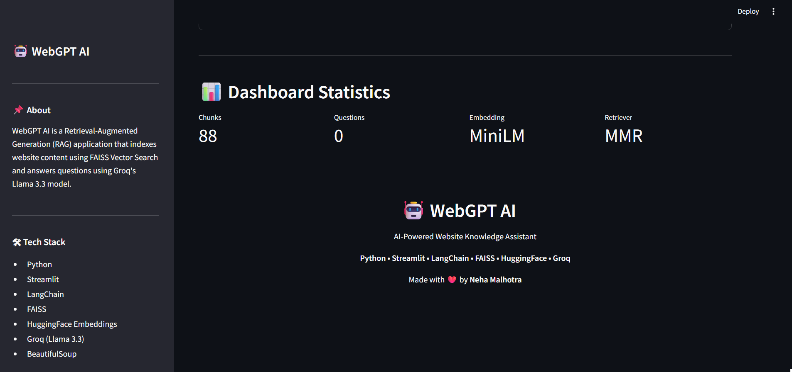
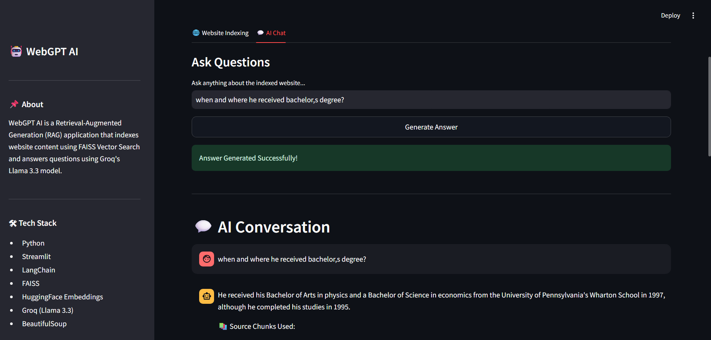
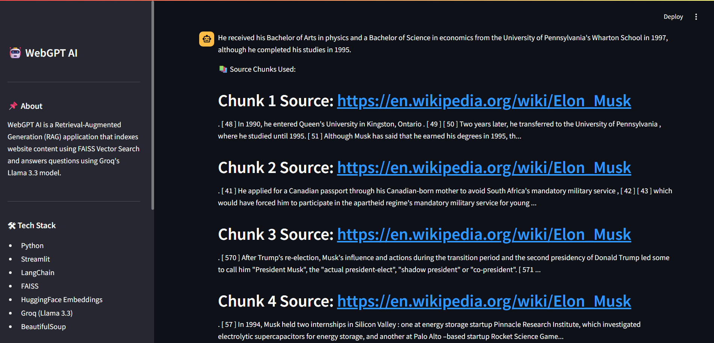
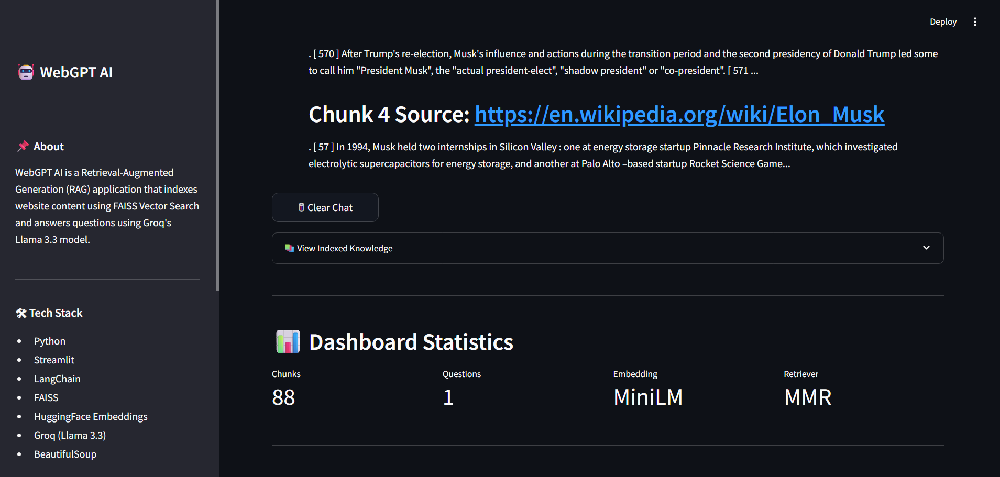

# 🤖 WebGPT AI

An AI-powered **Website Knowledge Assistant** that scrapes website content, converts it into vector embeddings, stores them in a **FAISS Vector Database**, and answers user questions using **Retrieval-Augmented Generation (RAG)** powered by **Groq's Llama 3.3 70B**.

---

## 🚀 Features

### 🌐 Website Processing
- Scrape website content using BeautifulSoup
- Automatic text cleaning and preprocessing
- Intelligent semantic text chunking
- Supports indexing of website knowledge

### 🧠 AI & Retrieval
- Retrieval-Augmented Generation (RAG)
- FAISS Vector Database
- HuggingFace Sentence Transformers Embeddings
- LangChain Retrieval Pipeline
- MMR (Maximal Marginal Relevance) Retrieval
- Fast LLM inference using Groq (Llama 3.3 70B)

### 💬 Interactive Experience
- Ask natural language questions
- Chat-style interface
- Display retrieved knowledge chunks
- Source-aware responses
- Interactive dashboard and statistics

### 🎨 User Interface
- Modern Streamlit UI
- Responsive layout
- Website indexing status
- Conversation history
- Dashboard metrics

---

# 🛠 Tech Stack

| Technology | Purpose |
|------------|---------|
| Python | Programming Language |
| Streamlit | Web Application |
| LangChain | RAG Pipeline |
| Groq (Llama 3.3 70B) | Large Language Model |
| FAISS | Vector Database |
| HuggingFace Embeddings | Text Embeddings |
| BeautifulSoup | Website Scraping |
| Requests | HTTP Requests |

---

# 📁 Project Structure

```
WebGPT-AI/
│
├── app.py
├── requirements.txt
├── .env
├── images/
└── README.md
```

---

# ⚙️ Installation

Clone the repository

```bash
git clone https://github.com/NehaM2006/ai-website-knowledge-assistant.git
```

Move into the project

```bash
cd ai-website-knowledge-assistant
```

Install dependencies

```bash
pip install -r requirements.txt
```

---

# 🔑 Environment Variables

Create a `.env` file in the project root.

```env
GROQ_API_KEY=your_groq_api_key
```

---

# ▶️ Run the Application

```bash
streamlit run app.py
```

The application will be available at:

```
http://localhost:8501
```

---

# 📸 Screenshots

### 🏠 Home



---

### 💬 Chat Interface


---

### 📚 Knowledge Retrieval





---

### 📊 Dashboard



---

### 🧠 Asked Questions




---

# 🏗️ How It Works

1. Enter a website URL.
2. Website content is scraped using BeautifulSoup.
3. The text is cleaned and split into semantic chunks.
4. HuggingFace generates embeddings for each chunk.
5. FAISS stores the vector embeddings.
6. LangChain retrieves the most relevant chunks using MMR.
7. Groq's Llama 3.3 70B generates a context-aware answer.
8. The application displays the response along with retrieved knowledge.

---

# 🚀 Future Enhancements

- 🌍 Multiple Website Indexing
- 📄 PDF Document Support
- 🗂️ Persistent Vector Database
- 💾 Chat History Storage
- 🔐 User Authentication
- 🌙 Dark Mode
- 📤 Export Conversations
- 🔗 Source Citations
- 📱 Mobile-Friendly UI

---

# 📚 What I Learned

While building this project, I gained practical experience with:

- Retrieval-Augmented Generation (RAG)
- LangChain Pipelines
- FAISS Vector Search
- HuggingFace Embeddings
- Prompt Engineering
- Streamlit Application Development
- Website Scraping using BeautifulSoup
- Groq LLM Integration
- Semantic Search
- AI-powered Question Answering

---

# 🎯 Resume Highlights

✔ AI-Powered Website Knowledge Assistant

✔ Retrieval-Augmented Generation (RAG)

✔ FAISS Vector Database

✔ LangChain Integration

✔ Groq Llama 3.3 API

✔ HuggingFace Embeddings

✔ Semantic Search

✔ Streamlit Dashboard

---

# 👩‍💻 Author

**Neha Malhotra**

**GitHub:**  
https://github.com/NehaM2006

**LinkedIn:**  
https://www.linkedin.com/in/neha-malhotra-54528b331

---

## 📜 License

This project is built for learning and portfolio purposes.

---

⭐ If you found this project useful, consider giving it a star on GitHub!